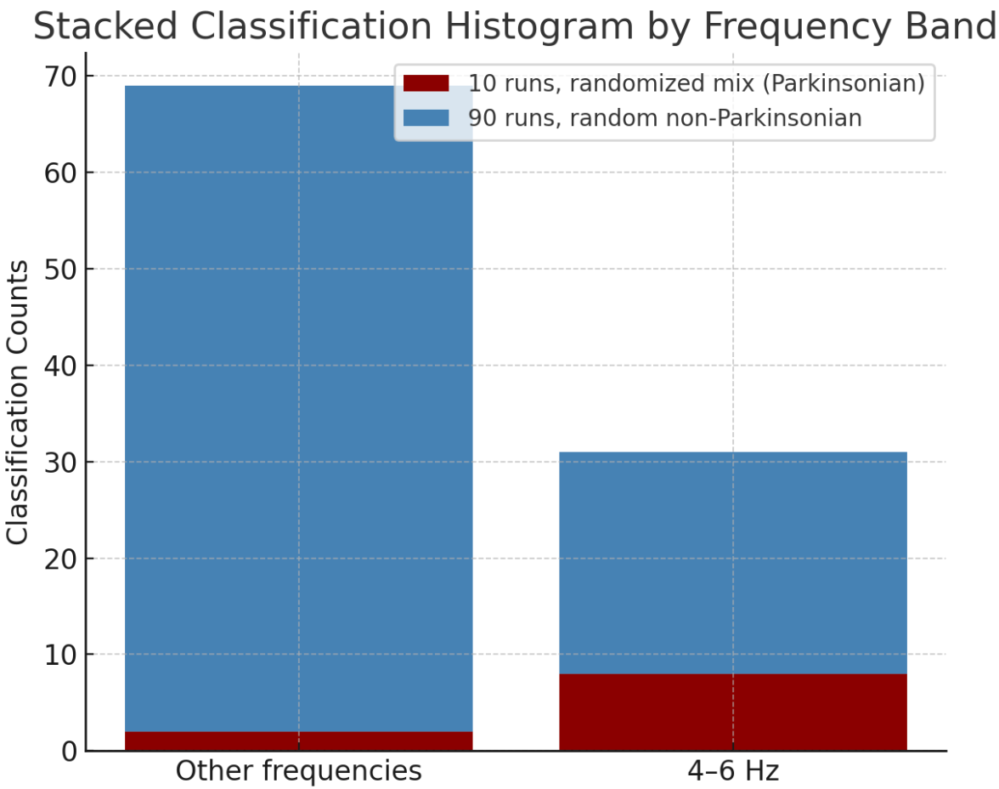

# Coursework Activity 4: Real-Time Parkinsonian Tremor Detection Using MMA8451Q Accelerometer

---
**Name:** Tasin Sayed  
**College:** Corpus Christi College  
**CRSid:** tes46

---

## 🧠 Project Overview

This project implements a lightweight, real-time classifier to detect Parkinsonian tremors based on dominant frequency analysis of 3-axis accelerometer data from the **MMA8451Q** sensor.

The algorithm samples acceleration at **40Hz**, calculates the **magnitude** of acceleration vectors, and uses the **Goertzel algorithm** to extract frequency-domain information in a rolling 0.5-second window. Frequencies in the range of **4–6Hz** are especially indicative of Parkinsonian tremors. [1]


## 📊 System Flowchart

<p align="center">
  
</p>

The system follows a non-blocking polling loop and classifies tremors based on the dominant frequency every 0.5 seconds using a Bayesian posterior confidence score. Note that on startup, the program will take 5s to set the ```0x0F``` HPF register at 1 Hz, to remove the offset due to gravity. We decided a Low-Pass filter was not required due to specific frequency extraction using the Goertzel DFT.

---

## 🗂️ File Structure

| File | Description |
|------|-------------|
| `boot.c` | Main execution file. Initializes the sensor, controls timing, and runs the main sampling loop. |
| `devMMA8451Q.c` | Contains low-level I2C communication and sensor configuration functions, as well as buffering and filtering logic. |
| `devMMA8451Q.h` | Header file for `devMMA8451Q.c` with function and constant declarations. |
| `detect.c` | Implements signal processing: Goertzel sequence update, power calculation, variance propagation, and Bayesian classification. |
| `detect.h` | Header file for `detect.c` with external declarations. |
| `config.h` | Global configuration, feature toggles, constants, and sensor activation flags. |

---

## 🌲 Function Call Tree
Refer to the flowchart for a brief summary of the operaation of each function - this call tree is better used to understand the inheritance between function calls and order of processing.

```text
boot.c  
│  
├── devMMA8451Q.c  
│   └── initMMA8451Q()  
│       └── configureSensorMMA8451Q()  
│           ├── writeSensorRegisterMMA8451Q()  
│           └── (sets sensor I2C registers and check status)  

├── detect.c  
│   └── while iteration for fixed iteration count limit to last 10s (main sampling loop at 40 Hz)  
│       └── byte_to_state_conversion()  
│           ├── devMMA8451Q.c  
│           │   └── readSensorRegisterMMA8451Q()  
│           ├── detect.c  
│           │   ├── convertAcceleration()  
│           │   └── get_sqrt()  
│           └── devMMA8451Q.c  
│               └── update_buffers()  
│                   ├── detect.c  
│                   │   └── update_goertzel()  
│                   │       ├── compute_power_uncertainty()   (only if variance flag enabled)  
│                   │       └── propagate_std_dev()  
│                   └── compute_goertzel_power()              (triggered every 0.5 s)  
│                       ├── compute_power_uncertainty()       (only if variance flag enabled)  
│                       └── calculate_baysean()
```

---

## 🔍 Detection Logic

- **Input**: Acceleration vectors (X, Y, Z) sampled at 40 Hz.
- **Buffer**: Magnitude buffer of 20 samples (0.5 seconds).
- **Frequency Analysis**: Goertzel algorithm applied at 11 bins (3–13 Hz).
- **Uncertainty**: Propagation of priot variance form magntidue and covariances between the Goetzel intermediate sequence, to a posterior variance from the Variance in Power / Power.
- **Classification**: Bayesian calculation using precomputed PDFs:
  - `PDF_parkinsonian[]`
  - `PDF_non_parkinsonian[]`
- **Output**: Prints dominant frequency and confidence score in detecting tremor.

---

## 📝 Limitations and Data Collection discussion

- All math is implemented in fixed-point integer format — scaled where needed — to accommodate SEGGER RTT print limitations. Internal computations have been verified to be correct through logging the terminal output on python script and running a digital twin of the system, exlcuding the sensor reading stage. This is mainly a data post processingf script to verify the calculations being performed in C. <br>
- Instead of importing the ``` math.h ``` library for square root, due to thius demanding too large stack memory allocation compared to a simple iterative method. This can however, result in Epistemic uncertainty, as on board there is no way live validate the inaccuracy of the iteration. <br>
- The report states the maximum polling rate is 55Hz, which wa sobserved in an alternaitve implementation polling all 6 bytes rather than 2 at a time - inside ``` byte_to_state_conversion ``` we are reading one of each 3 registers at once, resulting in Type B uncertaity alongside an epistemic error from the assumption of x, y, z magnitude being at the same snapshot of time. This should not nesessarily be a major issue for a limb-mounted sensor as intended, given the oscillations would be multiaxial (unlike the mono-axial vibrations on the IB Integrated Coursework building vibration transducer. 

<p align="center">
  
</p>

The following procedure describes how data for the Baysean classification was obtained. To evaluate Parkinsonian tremor likelihood, the classifier performs a hypothesis test using peak frequency bins based on Goertzel power. It compares:

- **H₁**: Subject exhibits Parkinsonian rest tremors  
- **H₀**: Subject is at rest or shows non-Parkinsonian motion

This is done by computing the discrete probability distributions **P(f | H₁)** and **P(f | H₀)**, where `f` is the frequency detected at peak power. Due to the absence of clinical tremor datasets, both PMFs were created empirically:

- **P(f | H₁)** was formed from **10 trials** with controlled oscillations between **4–6 Hz**, applied manually or using a coupled actuation rig. For each trial, the frequency bin with the highest Goertzel power was recorded.
  
- **P(f | H₀)** was derived from **90 trials** of:
  - The sensor at rest (static on a flat surface), and
  - Irregular or very low-frequency motions outside the Parkinsonian band

These histograms reflect how often each frequency bin shows up at peak power, forming **discrete PMFs** used in the Bayesian classifier. These models are visualized in the figure below:


- The Parkinsonian PMF shows a sharp peak centered on 5 Hz.
- The non-Parkinsonian PMF is broad and flat, indicating low frequency specificity at rest. [2]

### 📈 Propagation of Magnitude Variance

To quantify uncertainty in the raw acceleration input, we assume white Gaussian noise on each axis (x, y, z). This noise propagates into the magnitude calculation using:

```
            x²σₓ² + y²σᵧ² + z²σ_z²
σₐ²  =  ----------------------------
              x² + y² + z²
```

This result serves as the **input variance for the Goertzel sequence**, allowing uncertainty to be traced through each intermediate calculation.

### 🔁 Recursive Uncertainty in Goertzel Sequence

The Goertzel recurrence:

```
y[n] = x[n] + a·y[n−1] − y[n−2]
```

is updated with uncertainty propagation:

```
Var(y[n]) = Var(x) + a²·Var(y[n−1]) + Var(y[n−2]) + 2a·Cov(y[n−1], y[n−2])
```

Covariance terms are updated iteratively via:

```
Cov(y[n−1], y[n−2]) = a·Var(y[n−2]) − Cov(y[n−2], y[n−3])
```

This continues to the end of each 1 s rolling window (40 samples), giving full variance on `y[n−1]` and `y[n−2]`.

### 🧮 Posterior Power Variance

Power is computed from the final Goertzel terms. The **posterior uncertainty in power** is:

```
Var(P) = (2yₙ₋₁ − ayₙ₋₂)² · Var(yₙ₋₁)
       + (2yₙ₋₂ − ayₙ₋₁)² · Var(yₙ₋₂)
       + 2(2yₙ₋₁ − ayₙ₋₂)(2yₙ₋₂ − ayₙ₋₁) · Cov(yₙ₋₁, yₙ₋₂)
```

This variance can be printed for interpretability but is **not used in the final Bayesian probability calculation**, which relies only on the frequency PMFs. See above in the discussion regarding how it was not possible to verufy the statristical accuracy of the power variability/ relative variance calculations at 40Hz, due to the slow down caused by ```c warpPrint```.

### 📊 Classification Results

The classification output is summarized below:

<p align="center">
  
</p>

- **Red bars**: Frequency bins classified during Parkinsonian-like 4–6 Hz inputs.
- **Blue bars**: Classifications during rest or low-frequency motion.
The sharp separation between 4–6 Hz and other bins validates the discriminative power of the PMF model. See the report for further details about how this feeds into the hypothesis test.

---

*Note: All computations are implemented in fixed-point integer math with scaled variance tracking. Only Type A uncertainty is modeled here — firmware limitations (e.g., register quantization, integer rounding) introduce additional epistemic errors that are not accounted for.*

From the above, the variance propagation calculations are indeed done on board in 64 bit integer arithmetic. However, it was found to not be possible to validate all the live data and debug simultaneously as the data proceesing time was found to be > sampling period. Therefore, the intention of live detection could not be fulfilled, and is only read an validated outside the c-implementation. 


---

## ⚙️ Compilation Flags (in `config.h`)
In order to observe different outputs, different values should be turned on and off. All the above should be turned off, and set to 0 in the ```config.h``` for the exmaple output statement every 0.5s rolling window below. 

| Flag | Description |
|------|-------------|
| `MMA8451Q_RAW_DATA_COLLECT` | Enable raw accelerometer + power printouts for each Frequency bin 2-13 Hz.| 
| `MMA8451Q_RAW_VarError_PROP` | Enable variance/covariance propagation data to be printed - advisable to keep this 0 due to very large computational delays from warpPrint.|
| `MMA8451Q_Powerprintouts` | Enable individual frequency bin power output. `MMA8451Q_RAW_DATA_COLLECT`  needs to be set to active simultaneously to get satisfy the logic to get the prinout. |

---

## 📝 Example Output in RTT print
```bash
Dominant Oscillation detected at: 5 Hz. Probability of this being Parkinsonian tremors: 873 /1000.
```

## 📚 References

1. **Heida et al. (2014)**  
   *Quantifying Parkinsonian tremor in the frequency domain: evidence from accelerometry*  
   _Journal of Neurophysiology, 113(7)_, pp. 2562–2570.  
   [https://doi.org/10.1152/jn.00519.2014](https://doi.org/10.1152/jn.00519.2014)

2. **Stern, B. J. (2018)**  
   *Evaluation of Patients with Tremor*  
   _Practical Neurology_, May 2018 Issue.  
   [https://practicalneurology.com/articles/2018-may/evaluation-of-patients-with-tremor](https://practicalneurology.com/articles/2018-may/evaluation-of-patients-with-tremor)


